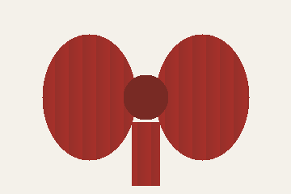

<!-- block:intro -->

铁丝边丝带最容易让蝴蝶结在客人离开前还保持形状。

<!-- block:width -->

## 宽度

<!-- block:width-body -->

普通花环先用 2.5 英寸丝带。树顶的大蝴蝶结可以用 4 英寸。

- <!-- block:ribbon -->

  铁丝边丝带
- <!-- block:wire -->

  花艺铁丝
- <!-- block:scissors -->

  剪刀

<!-- block:table -->

| 位置 | 宽度 |
| --- | --- |
| 门口花环 | 2.5 英寸 |
| 树顶 | 4 英寸 |

<!-- block:photo -->



<!-- block:sample -->

```text
门口花环：2.5 英寸
树顶：4 英寸
```
